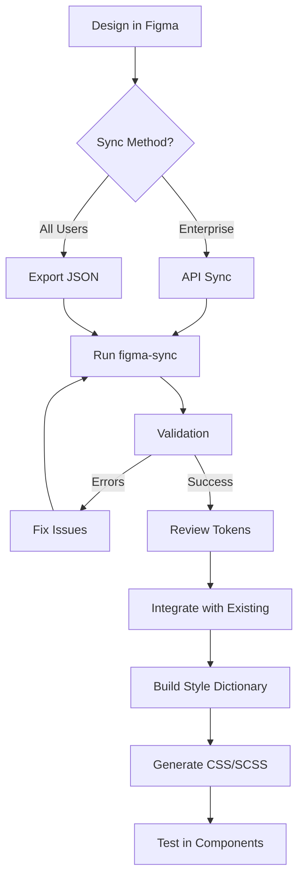

# Figma Token Synchronization

Complete guide for syncing design tokens between Figma and Style Dictionary.

## Table of Contents

- [Overview](#overview)
- [Features](#features)
- [Prerequisites](#prerequisites)
- [Setup](#setup)
- [Usage](#usage)
- [Configuration](#configuration)
- [Workflow](#workflow)
- [Troubleshooting](#troubleshooting)
- [Best Practices](#best-practices)

---

## Overview

The Figma Token Synchronization tool enables seamless integration between Figma Variables and Style Dictionary tokens. It supports both automated API sync (for Enterprise accounts) and manual JSON export/import workflows.

### Architecture

```
┌─────────────────┐
│  Figma Design   │
│   (Variables)   │
└────────┬────────┘
         │
         │ API or JSON Export
         ▼
┌─────────────────┐
│  figma-sync.mjs │
│   Transform     │
└────────┬────────┘
         │
         ▼
┌─────────────────┐
│ Style Dictionary│
│     Tokens      │
└────────┬────────┘
         │
         ▼
┌─────────────────┐
│   CSS/SCSS/JS   │
│     Output      │
└─────────────────┘
```

---

## Features

### ✅ Core Features

- **Dual Sync Methods**
  - REST API sync for Figma Enterprise accounts
  - Manual JSON import for all Figma users

- **Format Transformation**
  - Figma Variables → Style Dictionary JSON
  - Automatic type mapping (COLOR, FLOAT, STRING, BOOLEAN)
  - Alias/reference preservation

- **Validation & Safety**
  - Token structure validation
  - Automatic backups before sync
  - Error reporting with detailed diagnostics

- **Configuration**
  - Customizable collection mappings
  - Naming convention transformation
  - Output path configuration

### 🎯 Supported Token Types

| Figma Type | Style Dictionary Type | Example |
|------------|----------------------|---------|
| COLOR | color | `#3b82f6`, `rgba(59, 130, 246, 1)` |
| FLOAT | number | `16`, `1.5`, `24px` |
| STRING | string | `"Inter"`, `"bold"` |
| BOOLEAN | boolean | `true`, `false` |

---

## Prerequisites

### For API Sync (Enterprise Only)

1. **Figma Enterprise Account**
   - Required for REST API access to variables
   - Must be a full member of the organization

2. **Figma Personal Access Token**
   - Generate at: [Figma Account Settings](https://www.figma.com/settings)
   - Required scopes: `file_variables:read`

3. **Figma File Key**
   - Extract from your Figma file URL
   - Format: `https://www.figma.com/file/{FILE_KEY}/...`

### For JSON Import (All Users)

1. **Figma Variables Setup**
   - Create variable collections in Figma
   - Organize variables by type (colors, spacing, typography, etc.)

2. **Export Plugin**
   - Use a Figma plugin like:
     - "Design Tokens (W3C) Export"
     - "Design Tokens Manager"
     - Built-in Figma export (if available)

---

## Setup

### 1. Install Dependencies

The tool uses only Node.js built-in modules, so no additional installation is required.

```bash
# Verify Node.js version (v18+ recommended)
node --version
```

### 2. Configure Environment Variables (API Sync)

Create a `.env` file in the tokens package root:

```bash
# Figma API credentials
FIGMA_ACCESS_TOKEN=figd_your_access_token_here
FIGMA_FILE_KEY=your_figma_file_key_here
```

**Security Note:** Never commit `.env` files to version control. Add to `.gitignore`:

```bash
echo ".env" >> .gitignore
```

### 3. Configure Token Mapping

Edit `.figma-token-mapping.json` to define how Figma collections map to your project structure:

```json
{
  "mappings": {
    "collections": {
      "primitives": {
        "figmaCollectionName": "Primitives",
        "outputPath": "src/base",
        "description": "Base primitive tokens"
      }
    }
  }
}
```

---

## Usage

### Method 1: API Sync (Enterprise)

Sync directly from Figma using the REST API:

```bash
# Set environment variables
export FIGMA_ACCESS_TOKEN="figd_xxx..."
export FIGMA_FILE_KEY="abc123..."

# Run sync
npm run figma:sync
```

Or use the script directly:

```bash
node scripts/figma-sync.mjs --api
```

### Method 2: JSON Import (All Users)

1. **Export from Figma:**
   - Open your Figma file
   - Run a token export plugin
   - Save the JSON file (e.g., `figma-export.json`)

2. **Import to project:**

```bash
npm run figma:import -- path/to/figma-export.json
```

Or:

```bash
node scripts/figma-sync.mjs --import path/to/figma-export.json
```

### Validation Only

Validate token structure without writing files:

```bash
npm run figma:validate
```

---

## Configuration

### Token Mapping Configuration

The `.figma-token-mapping.json` file controls sync behavior:

#### Collection Mappings

Map Figma collections to output directories:

```json
{
  "mappings": {
    "collections": {
      "primitives": {
        "figmaCollectionName": "Primitives",
        "outputPath": "src/base",
        "description": "Base primitive tokens"
      },
      "semantic": {
        "figmaCollectionName": "Semantic Tokens",
        "outputPath": "src/semantic",
        "description": "Semantic component tokens"
      }
    }
  }
}
```

#### Type Mapping

Define how Figma types map to Style Dictionary:

```json
{
  "mappings": {
    "typeMapping": {
      "COLOR": "color",
      "FLOAT": "number",
      "STRING": "string",
      "BOOLEAN": "boolean"
    }
  }
}
```

#### Naming Conventions

Control token naming transformation:

```json
{
  "mappings": {
    "namingConventions": {
      "separator": "/",
      "caseStyle": "kebab-case",
      "preserveOriginal": false
    }
  }
}
```

Supported case styles:
- `kebab-case`: `color-primary-500`
- `camelCase`: `colorPrimary500`
- `snake_case`: `color_primary_500`
- `PascalCase`: `ColorPrimary500`

#### Transformations

Configure output format transformations:

```json
{
  "mappings": {
    "transformations": {
      "colors": {
        "format": "hex",
        "includeAlpha": true,
        "uppercaseHex": false
      },
      "spacing": {
        "unit": "rem",
        "basePixelSize": 16
      }
    }
  }
}
```

#### Sync Options

Control sync behavior:

```json
{
  "mappings": {
    "sync": {
      "createBackup": true,
      "backupRetention": 10,
      "validateBeforeWrite": true,
      "overwriteExisting": false,
      "mergeStrategy": "merge"
    }
  }
}
```

Merge strategies:
- `merge`: Combine with existing tokens
- `replace`: Replace all tokens
- `skip`: Skip if file exists

#### Ignore Patterns

Exclude specific variables or collections:

```json
{
  "mappings": {
    "ignore": {
      "collections": ["Test Collection"],
      "variables": ["debug-color"],
      "patterns": ["^_", "^test", "^debug"]
    }
  }
}
```

---

## Workflow

### Recommended Workflow



### Step-by-Step

1. **Design in Figma**
   - Create variables in organized collections
   - Use clear, hierarchical naming (e.g., `color/primary/500`)
   - Add descriptions for documentation

2. **Sync Tokens**
   ```bash
   npm run figma:sync
   # or
   npm run figma:import -- ./figma-export.json
   ```

3. **Review Output**
   - Check `src/figma-sync/` for generated tokens
   - Verify transformations are correct
   - Review validation warnings/errors

4. **Integrate Tokens**
   - Merge with existing tokens in `src/base/`, `src/semantic/`
   - Resolve any conflicts
   - Update references if needed

5. **Build & Test**
   ```bash
   npm run build
   npm run test
   ```

6. **Commit Changes**
   ```bash
   git add .
   git commit -m "feat(tokens): Sync tokens from Figma"
   ```

---

## Troubleshooting

### Common Issues

#### API Authentication Failed

**Error:** `API request failed with status 403`

**Solutions:**
- Verify `FIGMA_ACCESS_TOKEN` is correct and not expired
- Check token has `file_variables:read` scope
- Ensure you're a full member of the Enterprise organization
- Verify file key is correct

#### Variables Not Found

**Error:** `Fetched 0 variables from 0 collections`

**Solutions:**
- Ensure variables are created in the Figma file
- Check you're using the correct file key
- Verify variables are in "local" collections (not just remote)

#### Invalid JSON Format

**Error:** `Unrecognized JSON format`

**Solutions:**
- Ensure exported JSON is from a Figma Variables export plugin
- Check JSON structure matches expected format
- Try re-exporting from Figma

#### Type Conversion Errors

**Error:** `Unexpected color format at path.to.token`

**Solutions:**
- Check Figma variable types are supported (COLOR, FLOAT, STRING, BOOLEAN)
- Verify color values are valid RGB/RGBA
- Ensure number values are numeric

#### Alias Resolution Failed

**Warning:** `Skipping variable "..." - could not resolve value`

**Solutions:**
- Ensure aliased variables exist in the same collection
- Check alias references are not circular
- Verify all dependencies are included in export

### Debug Mode

Enable verbose logging for detailed diagnostics:

```bash
DEBUG=* node scripts/figma-sync.mjs --api
```

### Backup Recovery

If sync fails or produces incorrect results, restore from backup:

```bash
# List available backups
ls -la .figma-backups/

# Restore specific backup
cp -r .figma-backups/2025-12-08T10-30-00-000Z/* src/figma-sync/
```

---

## Best Practices

### Figma Organization

1. **Use Clear Naming Hierarchy**
   ```
   ✅ Good: color/primary/500
   ❌ Bad: blue500
   ```

2. **Organize by Type**
   - Create separate collections for colors, spacing, typography, etc.
   - Use modes for themes (light/dark)

3. **Add Descriptions**
   - Document token purpose and usage
   - Descriptions sync to `comment` field

4. **Use Aliases**
   - Create semantic tokens that reference primitive tokens
   - Example: `button-background` → `{color.primary.500}`

### Token Management

1. **Version Control**
   - Commit token files with meaningful messages
   - Review diffs before merging
   - Tag releases when tokens change

2. **Review Process**
   - Always review synced tokens before integrating
   - Test in components before production
   - Document breaking changes

3. **Backup Strategy**
   - Keep automatic backups enabled
   - Manually backup before major syncs
   - Test restore process periodically

4. **Integration Testing**
   ```bash
   # After sync, always test
   npm run build
   npm run test
   npm run storybook
   ```

### Automation

#### CI/CD Integration

Create a GitHub Action to sync tokens automatically:

```yaml
name: Sync Figma Tokens

on:
  schedule:
    - cron: '0 2 * * *'  # Daily at 2 AM
  workflow_dispatch:     # Manual trigger

jobs:
  sync:
    runs-on: ubuntu-latest
    steps:
      - uses: actions/checkout@v4

      - name: Setup Node.js
        uses: actions/setup-node@v4
        with:
          node-version: 18

      - name: Sync from Figma
        env:
          FIGMA_ACCESS_TOKEN: ${{ secrets.FIGMA_ACCESS_TOKEN }}
          FIGMA_FILE_KEY: ${{ secrets.FIGMA_FILE_KEY }}
        run: |
          cd packages/tokens
          npm run figma:sync

      - name: Build tokens
        run: |
          cd packages/tokens
          npm run build

      - name: Create PR
        uses: peter-evans/create-pull-request@v5
        with:
          commit-message: 'chore(tokens): Sync from Figma'
          title: 'Automated Figma Token Sync'
          body: |
            Automated token sync from Figma

            - Review token changes
            - Test in Storybook
            - Verify no breaking changes
          branch: figma-sync/automated
```

### Multi-Brand Support

For multi-brand design systems:

```json
{
  "mappings": {
    "collections": {
      "brand-a-light": {
        "figmaCollectionName": "Brand A / Light",
        "outputPath": "src/brands/a/light"
      },
      "brand-a-dark": {
        "figmaCollectionName": "Brand A / Dark",
        "outputPath": "src/brands/a/dark"
      },
      "brand-b-light": {
        "figmaCollectionName": "Brand B / Light",
        "outputPath": "src/brands/b/light"
      }
    }
  }
}
```

---

## Additional Resources

- [Figma Variables Documentation](https://help.figma.com/hc/en-us/articles/15339657135383-Guide-to-variables-in-Figma)
- [Figma REST API Documentation](https://developers.figma.com/docs/rest-api/)
- [Style Dictionary Documentation](https://amzn.github.io/style-dictionary/)
- [Design Tokens W3C Specification](https://tr.designtokens.org/format/)

---

## Support

For issues or questions:

1. Check this documentation
2. Review [Troubleshooting](#troubleshooting) section
3. Search existing issues on GitHub
4. Open a new issue with:
   - Error message
   - Steps to reproduce
   - Environment details (Node version, OS, etc.)

---

## Contributing

Improvements to the sync tool are welcome! Please:

1. Test thoroughly with various token structures
2. Update documentation for new features
3. Add error handling for edge cases
4. Follow existing code style

---

**Version:** 1.0.0
**Last Updated:** 2025-12-08
